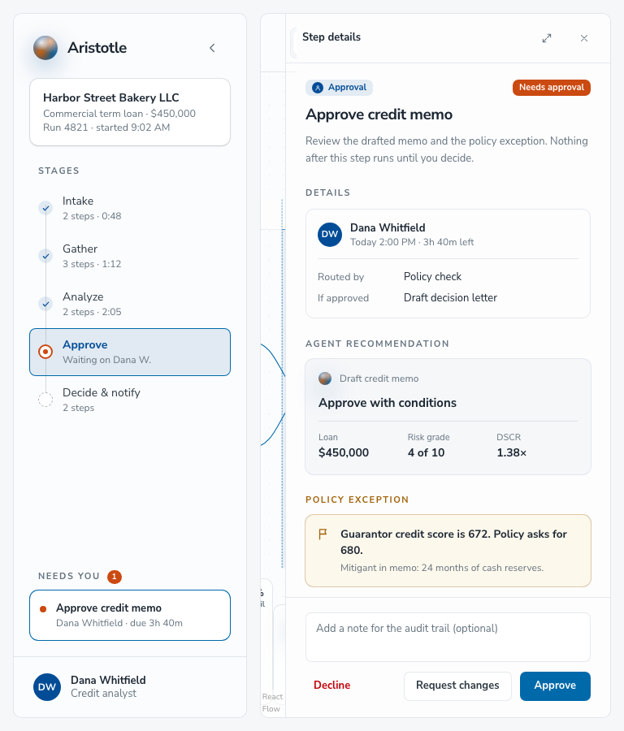
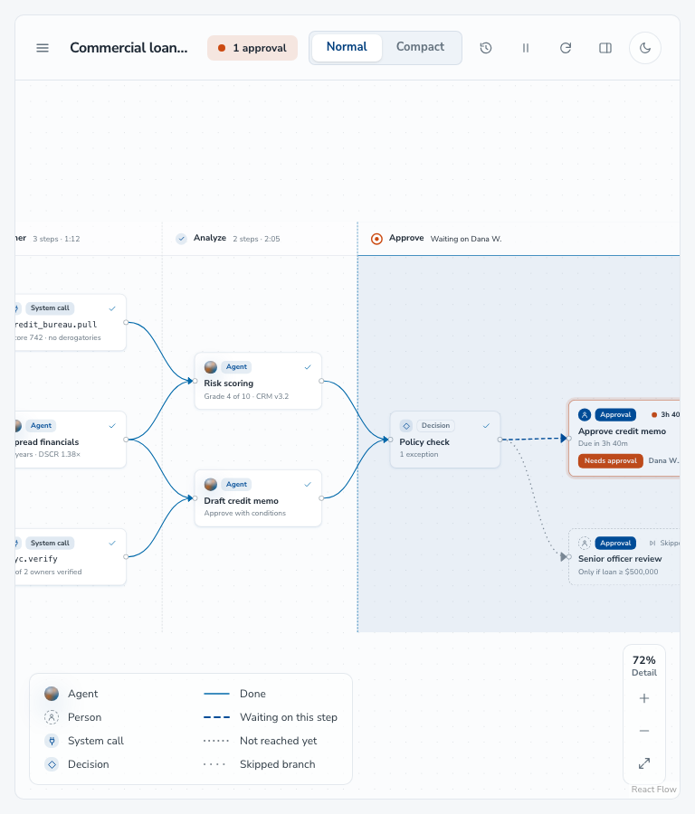
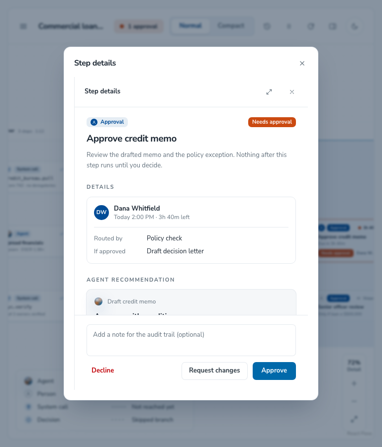

# Tablet and chat responsive review

29 September 2026. This review replaces the earlier assessment that applied phone-width requirements to non-chat components. The [responsive layout guidance](README.md) defines the corrected support contract and how to choose a logical fix.

## Scope

Non-chat stories were checked at **768, 820 and 1024px**, with a **1440px** desktop baseline. Chat stories additionally ran at **320, 360 and 390px**. Alert and Card were excluded as requested.

The matching before/after runs each covered **300 stories in 66 groups, with 1,443 story/width checks and zero render errors**. These totals differ from the initial 290-story run because the Storybook catalogue changed before the tablet reassessment.

## Priority decisions

| Original finding                     | Supported-width result                                                     | Disposition                           |
| ------------------------------------ | -------------------------------------------------------------------------- | ------------------------------------- |
| Omnibox chips push input offscreen   | No geometry failure at tablet or desktop widths in its registered stories. | Remove P1; leave component unchanged. |
| DiffViewer toolbar clips actions     | No geometry failure at tablet or desktop widths in its registered stories. | Remove P1; leave component unchanged. |
| Accordion wizard clips Continue      | No geometry failure at tablet or desktop widths.                           | Remove P1; leave component unchanged. |
| Workflow panels consume the canvas   | Confirmed at 768/820/1024px; toolbar actions were clipped.                 | **P1 fixed.**                         |
| Missing app-demo styles in Storybook | Source scanning included workflows but omitted other demo pages.           | **Preview infrastructure fixed.**     |

## P1 fix: preserve the workflow's working space

Below 1280px, the run outline and step details open on demand using the existing branded Modal. The canvas gets the available width. Selecting a stage or step opens its details; approval actions remain available. Escape closes the modal and returns focus to its trigger. The desktop three-column layout remains intact.

The workflow owns this composition change. The sidebar, inspectors and Modal retain their existing contracts. No phone-width requirement was added to these non-chat components.

Storybook now scans the whole app demo directory so app-page responsive utilities are generated consistently.

## Before and after

Same 768 × 900 viewport, test data, light theme and browser conditions:

| Before: panels squeeze the canvas                             | After: usable canvas and reachable controls           |
| ------------------------------------------------------------- | ----------------------------------------------------- |
|  |  |

The graph is intentionally pannable; nodes outside its viewport are not missing toolbar actions. Details remain available with Approve, Request changes and Decline visible:

Additional matched captures: [820px before](evidence/workflow-before-820.png) / [after](evidence/workflow-820.png), [1024px before](evidence/workflow-before-1024.png) / [after](evidence/workflow-1024.png), and [1440px desktop after](evidence/workflow-1440.png).

## Verification

- Full before/after audit: 300 stories, 66 groups, 1,443 checks per run; no render errors.
- Dedicated Playwright regression passed at 768, 820, 1024 and 1440px.
- Canvas widths after the fix: **734, 786, 990 and 702px**, respectively; desktop retains side panels.
- Normal, Compact and Run log controls remain within the viewport.
- Both tablet overlays open; Escape dismisses them and restores focus to the trigger.
- Approval actions remain visible, and Compact view can be selected.
- Repository typechecking, targeted lint and Storybook build passed.

[Saved regression measurements](evidence/workflow-checks.json). Reproduce with `npm run build-storybook`, `npm run audit:responsive`, and `npm run test:tablet-workflow`.

## Remaining follow-ups

- **P2, chat story hosts:** fixed-width wrappers for ReferencePanel, CitationChip preview, PersonaPanel and RecentChatsPanel still exceed phone widths. Make the hosts fluid before attributing their overflow to the components.
- **P2, tablet table density:** the tenant page's Primary contact header is clipped at 1024px; search, table content and pagination remain available.
- **Audit interpretation:** workflow stage buttons outside the current graph pan position still trigger geometry flags. Dedicated tests distinguish these from clipped toolbar controls.
- **Separate accessibility check:** the correctly translated, closed chat sidebar generates offscreen geometry flags below 1024px. Its keyboard/inert behavior was not certified by this visual audit.

Raw non-desktop flagged cases were 17 before and 22 after. The five additional cases are the closed chat sidebar detected after its responsive CSS was generated. Workflow cases remain flagged because graph nodes are intentionally outside the pan viewport. The aggregate count therefore does not measure the P1 fix; use the targeted assertions and matched screenshots.

This is a registered-story geometry audit with selected interaction checks, not a guarantee for every exported component, locale, touch device or state. External assets were blocked, so font/image fallback is possible. Findings describe the captured Storybook build.
